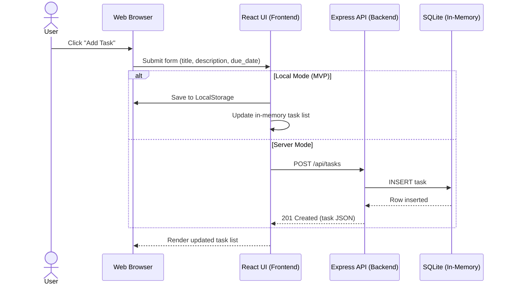

# Cloud Architecture Overview

A simple system-context view of this monorepo’s TODO application.

```mermaid
flowchart LR
	U[User] --> B[Web Browser]

	subgraph Client (packages/frontend)
		FE[React UI]
		B --> FE
		FE -->|MVP Local Mode| LS[(Browser LocalStorage)]
	end

	subgraph Server (packages/backend)
		API[Express API Server]
		DB[(SQLite In-Memory DB)]
		FE -->|HTTP/JSON| API
		API --> DB
	end
```

- Client: React app (packages/frontend) runs in the browser.
- Local Mode: Tasks can be stored in browser localStorage (MVP scope).
- Server Mode: React app calls Express API (packages/backend), which persists to an in-memory SQLite database.
- Primary API surface: `/api/tasks` (list/create/update/patch/delete).

## Create TODO Flow


